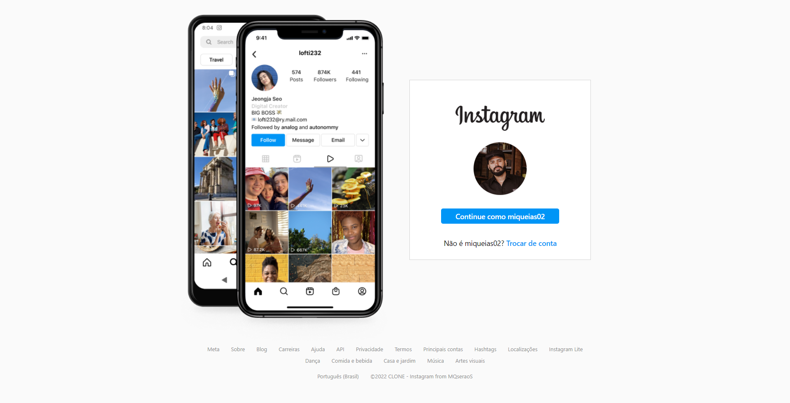
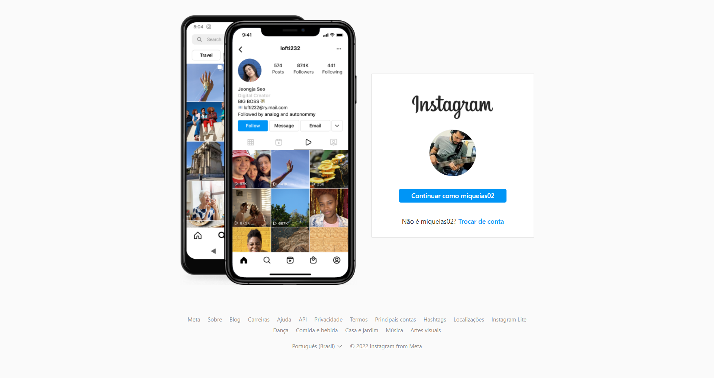

<h1> Clone / login do instagram </h1>

<h2>Descrição</h2>

Nesse projeto o grande desafio foi de reconstruir o CLONE fiél da página de login do Instagram. 
  desde o posicionamento de elementos ao slide de imagens que existe no layout original. 
   
  Utilizei Flexbox para posicionamento dos elementos e JavaScript para o slide de imagens. 
 

<a href="https://mqsoares.github.io/flex-turismo/" target="_blank">Confere aqui o vídeo de apresentação</a>

<a href="https://mqsoares.github.io/clone-login-instagram/" target="_blank">Confere aqui projeto no ar</a>

<h2>Tecnologias</h2>
<ul>
  <li>HTML</li>
  <li>CSS</li>
  <li>JavaScript</li>
</ul>

<h2>Features</h2>
<ul>
  <li>Responsivo</li>
  <li>Flexbox</li>
  <li>JavaScript</li>  
</ul>

<h2>Preview CLONE</h2>
 

  

<h2>Preview ORIGINAL</h2>
 

  
    

<h2> 
<a href="https://www.linkedin.com/in/mq-soares" target="_blank">Meu Linkedin</a>
</h2>
